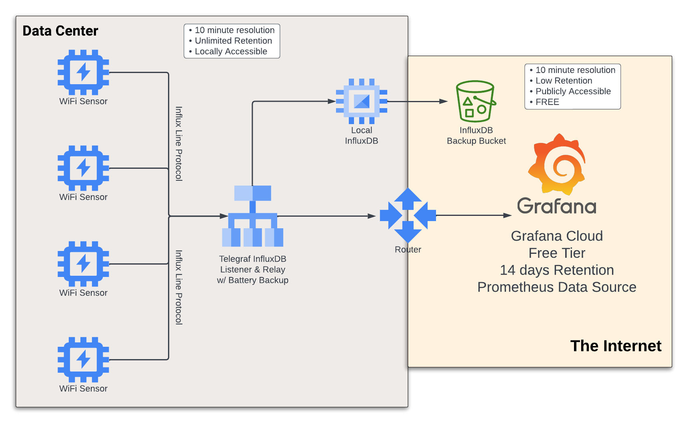
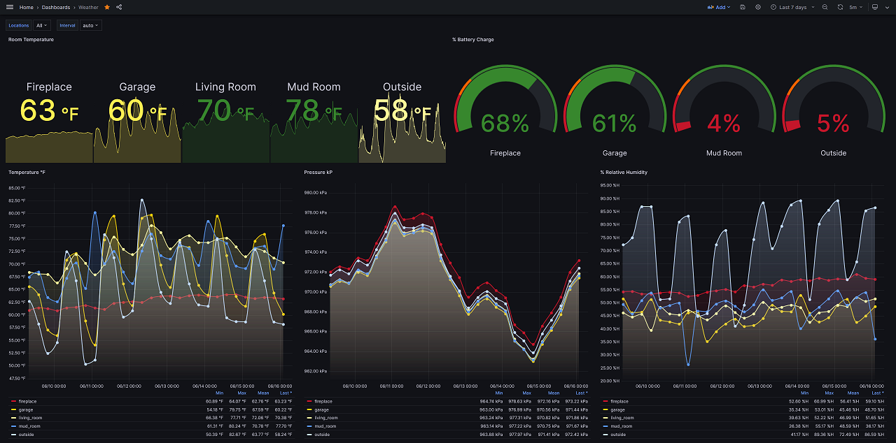
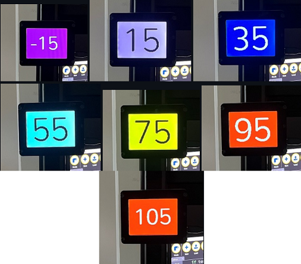

# AdaFruit Feather ESP-S2 BME280 Weather Station

The purpose of this project was to have a low-cost temperature sensor
solution for home use.  While investigating temperature sensors it seemed that
most sensors start at around $35 and are limited to N number of sensors.  Many
of them included subscriptions which I don't like.

The solution that I came up with based on my recent learning of time series
databases and moving metrics across the wire has been really stable so far.
I've tried to make it as simple as possible with as few moving parts.

At 10 minute interval the 2500mAh provides ~2 months of battery.

## Diagram


## Grafana Dashboard


## Physical Visualizer

After creating the backend and dashboards I found it painful to constantly have
to open a device to see the temperature.  Using an
[AdaFruit PyPortal](https://www.adafruit.com/product/4116) I was able to easily
visualize from a great distance the temperature.  I am pretty happy with the
result.  You could probably accomplish the same result with much cheaper
hardware, but this is what I had around!

[PyPortal Temperature Visualizer on GitHub](https://github.com/rgravlin/pyportal-temperature-monitor)



## InfluxDB Docker Backup

My local InfluxDB runs on my main computer because it's on 24x7.  I use Docker
because I run Windows, but didn't want to limit myself.  Thankfully InfluxDB is
extremely well-made, and is not very impactful on the host.

The following command can be used to easily create a backup of the very small
sensor database for off-site storage purposes.  This will cost pennies per
month in any cloud blob storage offering.

Why backup this way?  There is no down sampling.  We have perfect resolution
in every backup and the backups can be used to restore any time ranges from
within each backup.

```bash
docker run -v /path/to/backup/dir:/backups influxdb:1.8 \
  influxd backup \
  -portable \
  -host host.docker.internal:8088 \
  /backups
```

Sensor:
* [AdaFruit Feather ESP-S2 BME280](https://www.adafruit.com/product/5303)

Battery: 
* [Lithium-Ion Polymer Battery - 3.7v 2500mAh](https://www.adafruit.com/product/328)

Relay:
* [Fanless Mini PC Intel Atom Z8350 Processor, 8GB LDDR3, 128GB EMMC](https://www.amazon.com/gp/product/B0BCFBJ212)

Battery Recharging:
* [5V 2.5A Switching Power Supply with 20AWG MicroUSB](https://www.adafruit.com/product/1995)
* [PowerBoost 1000 Charger - Rechargeable 5V Lipo USB Boost @ 1A - 1000C](https://www.adafruit.com/product/2465)